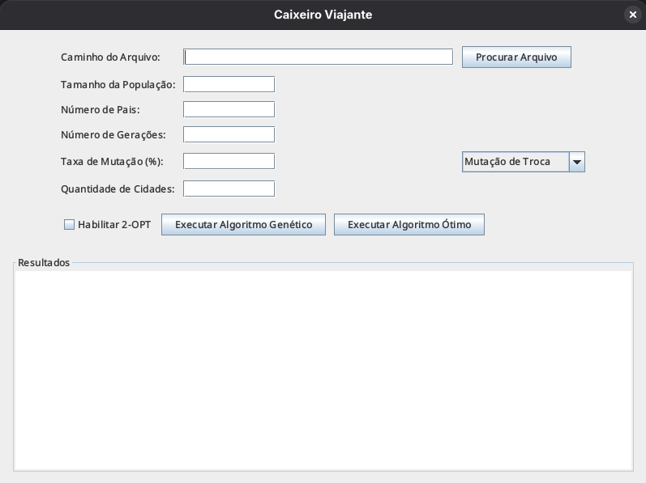
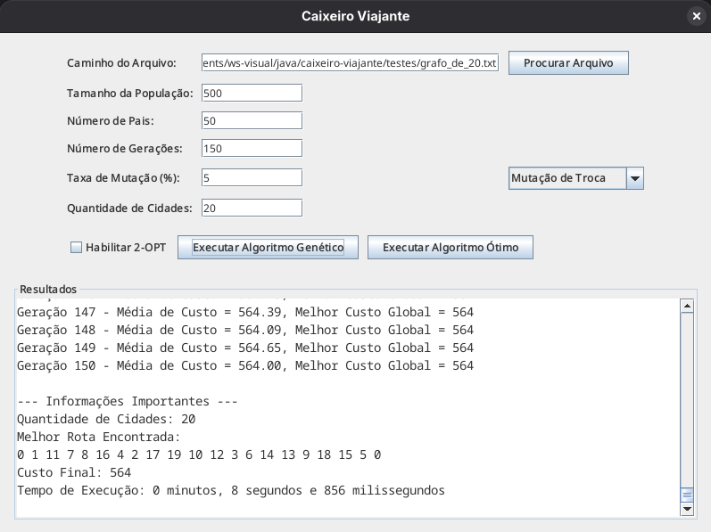

# Caixeiro viajante #


> O objetivo do software é resolver o clássico Problema do Caixeiro Viajante (Traveling Salesperson Problem - TSP) utilizando duas abordagens distintas para fins de comparação: uma heurística (Algoritmo Genético) e uma exata (Branch and Bound).

<div align="center">
  <table>
    <tr>
      <td align="center">
        
        <br>
        <sub><b>Menu Inicial</b></sub>
      </td>
      <td align="center">
        
        <br>
        <sub><b>Aplicação rodando</b></sub>
      </td>
    </tr>
  </table>
</div>

## Sobre o Projeto

A aplicação possui uma interface gráfica (GUI) construída em Java Swing, permitindo ao usuário carregar arquivos de grafos, configurar parâmetros de execução e visualizar os resultados e métricas de desempenho (custo da rota e tempo de execução) em tempo real.

## Algoritmos implementados

1. **Algoritmo Genético (Heurística):**
- Permite definir tamanho da população, número de gerações e taxa de mutação.
- Seleção por Roleta.
- Cruzamento (Crossover) baseado em arestas.
- 4 Tipos de Mutação: Troca, Inversão, Mistura e Inserção.
- Otimização Local: Implementação opcional do algoritmo 2-OPT para refinamento da rota.

2. **Algoritmo Branch and Bound (Exato):**
- Garante a solução ótima global.
- Utiliza poda baseada em limites inferiores para reduzir o espaço de busca.

## Ferramentas Utilizadas

- Liguagem: Java
- GUI: Java Swing

## Executando o Projeto

Siga as instruções abaixo para executar o projeto em seu ambiente local:

1. **Clone o repositório:**

   ```
   git clone https://github.com/oleandrobalbino/caixeiro-viajante.git
   ```

2. **Navegue até o diretório do projeto:**

   ```
   cd caixeiro-viajante/src
   ```

3. **Compile os arquivos:**

   ```
   javac *.java
   ```

4. **Execute o arquivo:**

   ```
   java Menu
   ```

## Autor

- Leandro Balbino

